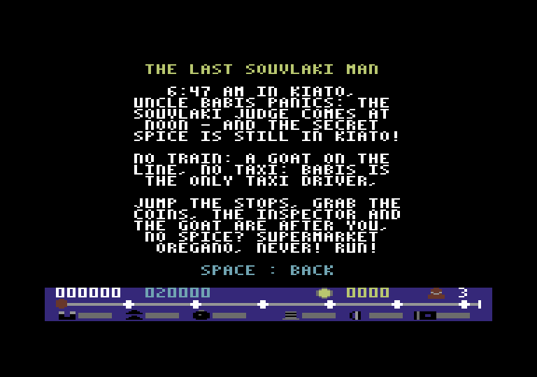
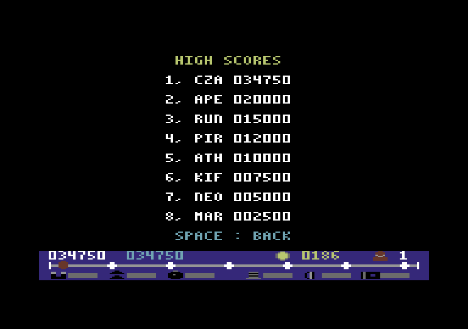

# Runner A.P.E.R — Commodore 64

**Runner A.P.E.R** (*Athens Piraeus Electric Railways*) is a top-down endless runner for the **Commodore 64**
(PAL), written in **6510 assembly**. It is the C64 version of the
[Amstrad CPC 6128 game](https://github.com/vaspervnp/APERRunner): the same world, rules, texts and music.

Run along the three tracks of the electric railway, collect coins, jump over buffer stops, climb onto train roofs
from the ramps and keep away from the red signals, from the city avenue all the way to the forest and on to Piraeus.

**Player's manual:** [English](docs/manual_en.md) ([PDF](docs/manual_en.pdf)) ·
[Ελληνικά](docs/manual_el.md) ([PDF](docs/manual_el.pdf)) · **Disk cover:** [docs/cover](docs/cover/) ·
**Plan and architecture** (in Greek): [planc64.md](planc64.md)

| | | |
|---|---|---|
|  |  |  |
|  |  |  |
|  |  |  |

---

## Features

- **Multicolor character mode** with a smooth **vertical scroll** (fine scroll + double-buffered coarse scroll) at a
  steady **50 frames a second**: no frame lost in 10 minutes of play on every difficulty (tested).
- A **HUD strip** at the bottom that never moves (a raster split with an FLD black band): score and best score,
  coins and lives, the route Kiato → Piraeus with the stations, the six power-ups with time bars, and the names of
  power-ups and stations as you take or pass them.
- **The CPC's world, row for row**: the generator is the Z80 one ported decision by decision and random number by
  random number (tested against the CPC itself): tracks, trains, ramps, buffer stops, signals, bridges, city and
  forest, stations with platforms, coins and power-ups.
- **5 heights**: the runner (two sprites: a multicolor body and a hires outline) gets bigger the higher he is; under
  a bridge deck he is cut line by line.
- **Power-ups**: turbo, slow, magnet (coins fly to you as sprites), super jump, helmet, 2x coins.
- **3 difficulty levels**; on HARD you also jump the gaps between wagons.
- **SID music and effects**: the CPC's three tunes and five effects on the SID.
- **Menus** with the logo, story, controls, countdown, pause, game over with name entry, **8 high scores saved to
  disk** (file `SCORES`), **English and Greek** (`L`).
- Joystick in port 2 or keyboard.

## What is different from the CPC version

The C64 has 256 characters, colour RAM in 4×8 cells and 8 sprites, so a few things changed:

- The HUD is a strip at the bottom instead of a panel on the right (a side panel would shake with the scroll).
- Colours are fixed per screen column; the trains come in two liveries instead of three.
- The trains and cars do not move; the signals are always red; there is no day and night cycle and no demo.
- Speeds: 2.1 / 2.8 / 3.5 pixels a frame (EASY / MEDIUM / HARD), turbo + 1.4 up to 4.0 (the most the double
  buffer allows); the playfield shows 145 lines of the line ahead.
- The wagons are 50 % longer (18 rows instead of 12), so there is time for the next jump on the roofs; the chunks
  are the CPC's, stretched when they are compiled.
- Names of power-ups and stations are written in the HUD (the tracks' red edge columns would hide letters).

---

## Build & run

```bash
make            # graphics + tracks + texts + music + assembly -> build/runner.d64
make run        # x64sc with the disk autostarted
make test       # headless tests in VICE (binary monitor)
make stutter    # 10 minutes x 3 difficulties x 3 seeds: frames lost and the heaviest frame
make screenshots    # docs/screenshots/*.png from headless VICE
make docs       # docs/manual_*.pdf and the disk cover (docs/cover/)
```

On a real C64: write `build/runner.d64` to a disk (or use an SD2IEC / Ultimate / Kung Fu Flash), then
`LOAD"RUNNER",8` and `RUN`.

Requirements:

- [64tass](https://sourceforge.net/projects/tass64/), VICE 3.9 (`x64sc`, `c1541`), Python 3 with Pillow;
- for `make docs`: a Chromium browser (default: Microsoft Edge of Windows, reached from WSL; `EDGE=` otherwise);
- for the comparison with the CPC (`tests/test_world_cpc.py`): the CPC repository next to this one
  (`../APERRunner`), its build tools (rasm, iDSK) and its headless emulator (`~/cpcemu`); otherwise it is skipped.

## Tests

Every test module starts its own headless VICE and drives it through the binary monitor (checkpoints, memory,
registers, the picture): the scroll pixel by pixel, the raster split's timing, the world against a Python model and
against the CPC, the runner and the collisions, coins and power-ups, the HUD read back from the screen, the menus
and the high scores on a `.d64`, the SID's registers and envelope, the frame load, and other C64 models (C64C,
the first VIC-II, NTSC).

## Layout

```
src/        6510 sources (main, video, world, player, pickups, hud, screens, disk, sound)
gfx/png/    source art (indexed PNG, C64 palette) and the cover art
levels/     track chunks (the CPC's)
text/       screen texts, English and Greek (the CPC's)
music/      tunes and sound effects (the CPC's)
tools/      converters (graphics, chunks, texts, logo, music), the world model, screenshots, docs
tests/      headless VICE tests
docs/       manuals, screenshots, disk cover
build/      generated files (.prg, .d64, labels)
```

---

## Credits

**REVIVE8BIT · 2026 · VASPER**

Inspired by the Athens–Piraeus electric railway (Line 1). *No goats were harmed in the making of this game.*
