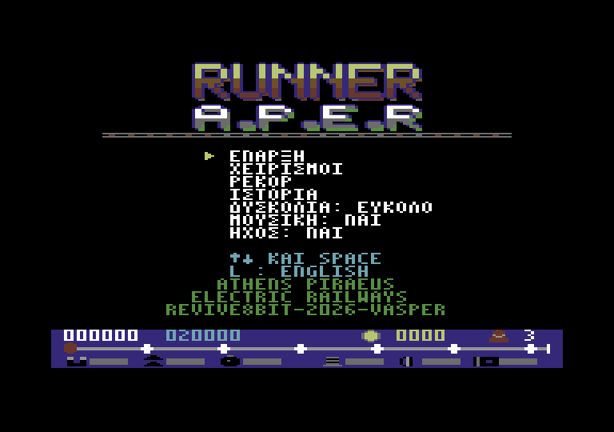
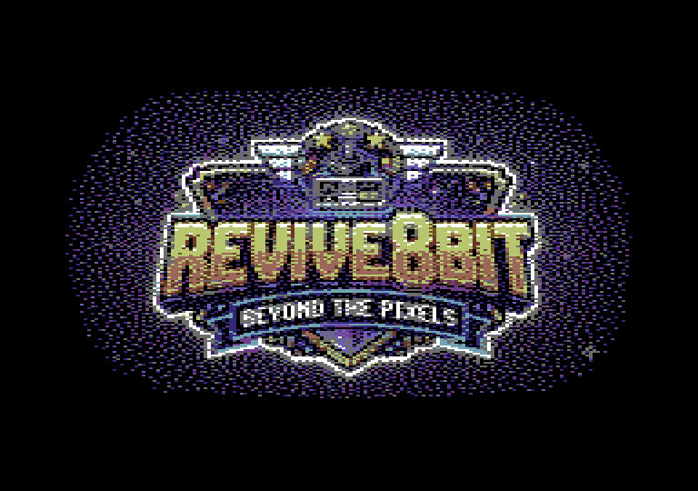
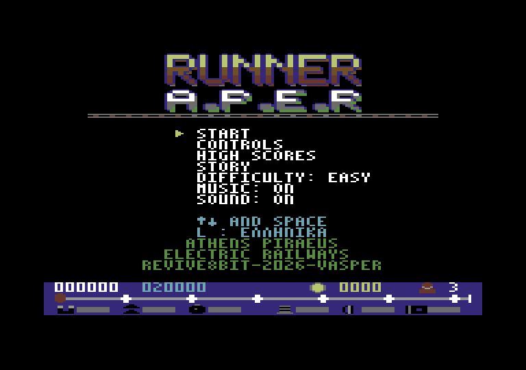
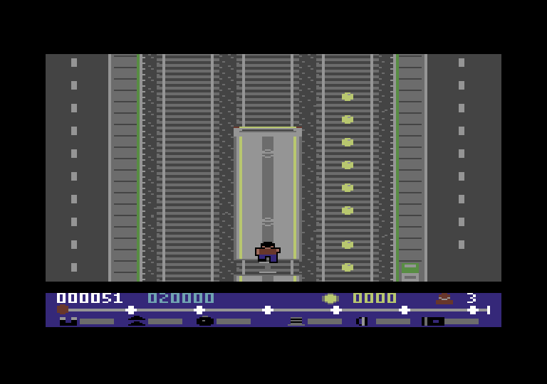
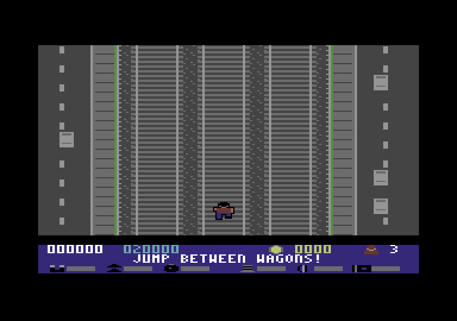
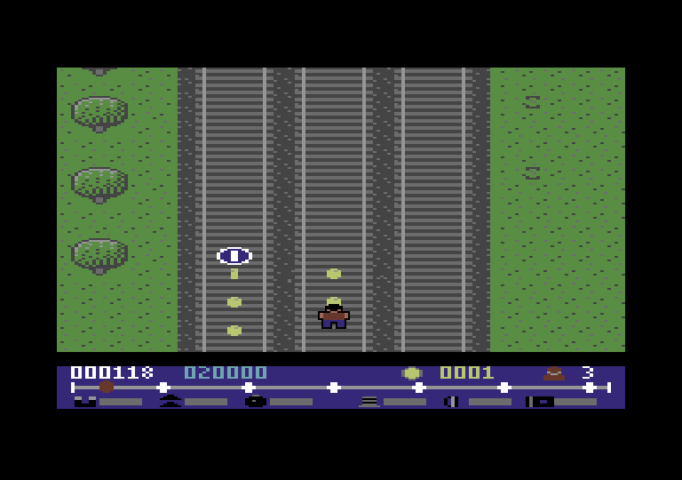
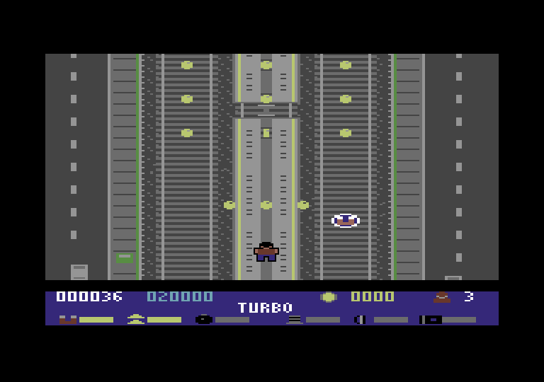
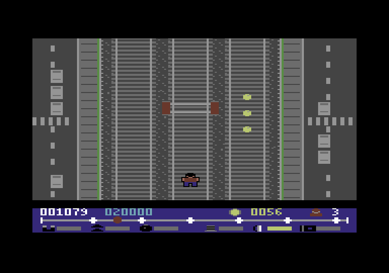
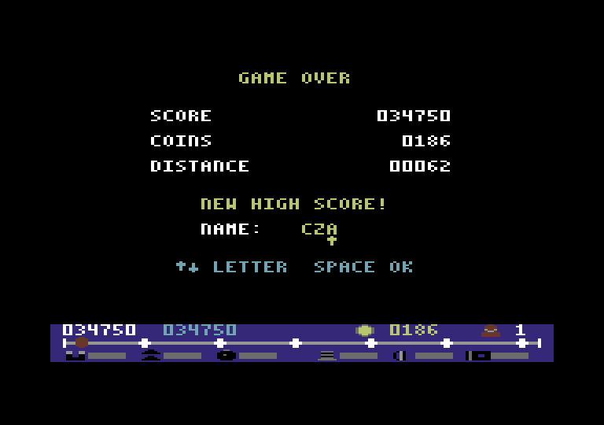

# RUNNER A.P.E.R

## Εγχειρίδιο παίκτη

*Ηλεκτρικοί Σιδηρόδρομοι Αθηνών–Πειραιώς* · για Commodore 64 (PAL) · δισκέτα



---

## Φόρτωση

1. Άνοιξε τον Commodore 64 και τον οδηγό δισκέτας (συσκευή 8).
2. Βάλε τη δισκέτα **RUNNER APER**.
3. Γράψε `LOAD"RUNNER",8` και πάτα **RETURN**. Όταν εμφανιστεί το `READY.`, γράψε `RUN` και πάτα **RETURN**.

Πρώτα εμφανίζεται η οθόνη του **REVIVE8BIT** (σε περίπου μισό λεπτό). Μένει 10 δευτερόλεπτα, ή ώσπου να πατήσεις
**SPACE** (ή FIRE)· μετά φορτώνει το ίδιο το παιχνίδι, με την οθόνη να φαίνεται ακόμα. Σε έναν κανονικό οδηγό 1541
αυτό παίρνει περίπου δύο λεπτά ακόμα (λιγότερο με cartridge γρήγορης φόρτωσης). Μετά εμφανίζεται το κεντρικό μενού.



Βάλε το joystick στη **θύρα 2**, ή παίξε με το πληκτρολόγιο.

> Τα ρεκόρ σου σώζονται στη δισκέτα, στο αρχείο `SCORES`. **Μην** την προστατεύσεις από εγγραφή αν θέλεις να
> κρατήσεις τα ρεκόρ σου.

---

## Η ιστορία: Ο τελευταίος σουβλατζής

Είναι 6:47 το πρωί στο Κιάτο. Ο θείος σου ο Μπάμπης, ο καλύτερος σουβλατζής του Πειραιά, σε πήρε τηλέφωνο
αλαφιασμένος. Σήμερα στις 12:00 έρχεται ο κριτής του «Χρυσού Καλαμακιού», και ο Μπάμπης έχει ξεχάσει στο Κιάτο το
μυστικό μπαχαρικό της γιαγιάς: ένα βαζάκι με ετικέτα «ΜΗΝ ΤΟ ΑΓΓΙΞΕΙΣ, ΜΠΑΜΠΗ».

Πήγες να πάρεις τον προαστιακό. Η αμαξοστοιχία όμως ακυρώθηκε λόγω «απρόβλεπτης παρουσίας κατσίκας στη γραμμή».
Ταξί δεν υπάρχει, γιατί ο μόνος ταξιτζής του Κιάτου είναι ο ίδιος ο Μπάμπης.

Έτσι τρέχεις στις ράγες με το βαζάκι στην τσέπη. Πηδάς τα στοπ. Ανεβαίνεις στις οροφές των τρένων που, παραδόξως,
κυκλοφορούν κανονικά για όλους εκτός από σένα. Μαζεύεις κέρματα για το εισιτήριο που δεν πρόλαβες να βγάλεις.

Ο ελεγκτής σε κυνηγάει από το Λουτράκι. Η κατσίκα επίσης.

Αν δεν φτάσεις, ο Μπάμπης θα βάλει στα καλαμάκια ρίγανη από το σούπερ μάρκετ. Και αυτό, στον Πειραιά, δεν
συγχωρείται ποτέ.

**ΤΡΕΞΕ!**

---

## Το κεντρικό μενού

Κινήσου με **↑ ↓** (το joystick, τα `Q` / `A` ή τα πλήκτρα του κέρσορα) και διάλεξε με **SPACE** ή **FIRE**.

| Επιλογή | Τι κάνει |
|---|---|
| ΕΝΑΡΞΗ | Ξεκινά ένα τρέξιμο |
| ΧΕΙΡΙΣΜΟΙ | Δείχνει τα πλήκτρα |
| ΡΕΚΟΡ | Οι 8 καλύτεροι δρομείς |
| ΙΣΤΟΡΙΑ | Γιατί στην ευχή τρέχεις |
| ΔΥΣΚΟΛΙΑ | ΕΥΚΟΛΟ / ΜΕΤΡΙΟ / ΔΥΣΚΟΛΟ |
| ΜΟΥΣΙΚΗ | Μουσική ναι ή όχι |
| ΗΧΟΣ | Όλος ο ήχος ναι ή όχι |

Με το **L** αλλάζεις ανάμεσα σε ελληνικά και αγγλικά.



---

## Χειρισμοί

| Ενέργεια | Joystick (θύρα 2) | Πληκτρολόγιο |
|---|---|---|
| Μία γραμμή αριστερά | αριστερά | `O` ή `CRSR ←` |
| Μία γραμμή δεξιά | δεξιά | `P` ή `CRSR →` |
| Άλμα | πάνω ή FIRE | `Q`, `SPACE` ή `CRSR ↑` |
| Γρήγορη προσγείωση | κάτω | `A` ή `CRSR ↓` |
| Παύση / συνέχεια | — | `H` |
| Μουσική ναι/όχι | — | `M` |
| Τα παρατάς, πίσω στο μενού | — | `RUN/STOP` |

---

## Το παιχνίδι



Τρέχεις στο κάτω μέρος της οθόνης και η γραμμή έρχεται προς τα πάνω σου. Υπάρχουν **τρεις γραμμές**. Άλλαξε γραμμή
για να αποφύγεις ό,τι έρχεται, πήδα για να το περάσεις και μάζεψε όσα κέρματα μπορείς. Όσο είσαι στον αέρα περνάς
**από πάνω** από κέρματα και power-ups χωρίς να τα παίρνεις, οπότε διάλεγε καλά πότε θα πηδήξεις.

Κάθε τρέξιμο ξεκινά με αντίστροφη μέτρηση πάνω στη γραμμή: **3, 2, 1, ΠΑΜΕ!** Στο **ΔΥΣΚΟΛΟ** το παιχνίδι σε
προειδοποιεί πρώτα, στο κάτω πάνελ, ότι πρέπει να πηδάς ανάμεσα στα βαγόνια.



Η γραμμή περνά μέσα από την **πόλη**, δίπλα σε μια λεωφόρο με αυτοκίνητα, λεωφορεία και περίπτερα, και βγαίνει στο
**δάσος**. Από πάνω περνούν πεζογέφυρες και γέφυρες αυτοκινήτων, και τρέχεις από κάτω τους. Όσο περισσότερο τρέχεις,
τόσο πιο πολλά εμπόδια έχουν οι γραμμές.



### Δυσκολία

| Επίπεδο | Ταχύτητα | Ιδιαιτερότητα |
|---|---|---|
| ΕΥΚΟΛΟ | ήπια | Τα εμπόδια πυκνώνουν αργά, ποτέ πάνω από 2 σε μία γραμμή μέσα σε μία οθόνη |
| ΜΕΤΡΙΟ | κατά ένα τρίτο πιο γρήγορα | Τα εμπόδια πυκνώνουν πιο γρήγορα |
| ΔΥΣΚΟΛΟ | όσο το ΜΕΤΡΙΟ | Πρέπει να **πηδάς τα κενά ανάμεσα στα βαγόνια** όταν τρέχεις στις οροφές |

### Ύψη

Ο δρομέας μεγαλώνει στην οθόνη όσο πιο ψηλά βρίσκεται.

| Ύψος | Πού είσαι |
|---|---|
| 1 | Στο έδαφος |
| 2 | Άλμα από το έδαφος: περνάς τα στοπ |
| 3 | Στην οροφή του τρένου |
| 4 | Άλμα στην οροφή, πάνω από τα βαγόνια |
| 5 | Το ψηλότερο άλμα πάνω από τρένο |

### Ζωές

Έχεις **3 ζωές**. Μετά από σύγκρουση αναβοσβήνεις για λίγο: είσαι προστατευμένος. Όταν χαθεί η τελευταία ζωή, το
παιχνίδι τελειώνει.

---

## Η οθόνη

Η γραμμή πιάνει όλο το πλάτος της οθόνης. Το πάνελ στο κάτω μέρος είναι το ταμπλό του τρένου:

- πρώτη σειρά: το **σκορ** σου (λευκό) και το **καλύτερο σκορ** (κυανό), τα **κέρματα** και οι **ζωές** που μένουν·
- δεύτερη σειρά: η **διαδρομή** από το Κιάτο στον Πειραιά, ένα σημάδι για κάθε σταθμό, το κόκκινο σημάδι είσαι εσύ.
  Εδώ γράφονται για δύο δευτερόλεπτα τα ονόματα: το power-up που πήρες, ο σταθμός που περνάς, και η ΠΑΥΣΗ·
- τρίτη σειρά: τα έξι **power-ups**: σκοτεινά όταν δεν τα έχεις, αναμμένα με μπάρα χρόνου όσο κρατούν.

## Η διαδρομή

Τρέχεις από το Κιάτο στον Πειραιά: **Κόρινθος, Μέγαρα, Ελευσίνα, Ασπρόπυργος, Ρέντης, Πειραιάς**. Όταν περνάς έναν
σταθμό χτυπά το καμπανάκι, το όνομά του γράφεται στο πάνελ και δεξιά κι αριστερά σου περνούν οι αποβάθρες του.
**Ο Πειραιάς δίνει 1000 πόντους** και η διαδρομή ξαναρχίζει.

---

## Power-ups

Ένα power-up εμφανίζεται κάθε 50 με 120 σειρές, ποτέ ακριβώς μπροστά από εμπόδιο. Μερικά είναι πάνω στις οροφές
των τρένων: ανέβα από τη ράμπα για να τα πάρεις.



| Power-up | Τι κάνει | Διάρκεια |
|---|---|---|
| Κέρμα | 10 πόντοι | — |
| ΤΟΥΡΜΠΟ | Πιο γρήγορα, και η απόσταση μετράει διπλή (το πιο συχνό) | 8 δλ. |
| ΑΡΓΑ | Μισή ταχύτητα: μια ανάσα | 8 δλ. |
| ΜΑΓΝΗΤΗΣ | Τραβάει τα κέρματα της γραμμής σου και των διπλανών | 10 δλ. |
| ΥΠΕΡΑΛΜΑ | Από το έδαφος πηδάς πάνω από τρένο | 10 δλ. |
| ΚΡΑΝΟΣ | Σε σώζει από μία σύγκρουση | ως το χτύπημα |
| 2Χ ΚΕΡΜΑΤΑ | Κάθε κέρμα μετράει διπλό | 15 δλ. |

Το ΤΟΥΡΜΠΟ και το ΑΡΓΑ ακυρώνουν το ένα το άλλο.

---

## Εμπόδια

| Εμπόδιο | Πώς το περνάς |
|---|---|
| Βαγόνι | Άλλαξε γραμμή, ανέβα από ράμπα ή χρησιμοποίησε το ΥΠΕΡΑΛΜΑ |
| Κενό ανάμεσα σε βαγόνια | Μόνο στο ΔΥΣΚΟΛΟ: πήδα το όταν τρέχεις στις οροφές |
| Μηχανή | Μην τη συναντήσεις από μπροστά στο έδαφος! |
| Ράμπα | Σε ανεβάζει στην οροφή· στο τέλος του τρένου κατεβαίνεις |
| Στοπ | Πήδα το ή άλλαξε γραμμή |
| Φανάρι | Πάντα κόκκινο: άλλαξε γραμμή, ή πήδα το από την οροφή ενός τρένου (ή με το ΥΠΕΡΑΛΜΑ) |



Το φανάρι είναι μια πύλη σε όλο το πλάτος της γραμμής του, με ένα κόκκινο φως σε κάθε πλευρά.

---

## Σκορ και ρεκόρ

```
σκορ = απόσταση (x2 με ΤΟΥΡΜΠΟ) + κέρματα x 10 (x2 με 2Χ ΚΕΡΜΑΤΑ)
```

Αν το σκορ σου μπει στα 8 καλύτερα, γράψε τα αρχικά σου: με **↑ ↓** διαλέγεις γράμμα και με **SPACE** ή **FIRE** το
κρατάς. Ο πίνακας σώζεται στη δισκέτα (η οθόνη σκοτεινιάζει για λίγο όσο γράφει ο οδηγός), οπότε τα ρεκόρ είναι εκεί
και την επόμενη φορά.



---

## Συμβουλές

- Κέρματα πάνω σε τρένο σημαίνουν ότι κάπου κοντά έχει ράμπα: ανέβα και μάζεψέ τα.
- Μην πηδάς πολύ νωρίς: στον αέρα χάνεις τα κέρματα.
- Κράτα το ΚΡΑΝΟΣ για τα δύσκολα κομμάτια. Χάνεται στην πρώτη σύγκρουση.
- Το ΑΡΓΑ είναι φίλος σου στο ΔΥΣΚΟΛΟ όταν οι γραμμές γεμίζουν.
- Φανάρι μπροστά στη γραμμή σου σημαίνει: άλλαξε γραμμή τώρα.

---

## Συντελεστές

**REVIVE8BIT · 2026 · VASPER**

Runner A.P.E.R για τον Commodore 64: κώδικας 6510, γραφικά multicolor και μουσική SID, από το παιχνίδι του Amstrad
CPC 6128. Εμπνευσμένο από τον ηλεκτρικό σιδηρόδρομο Αθηνών–Πειραιώς (Γραμμή 1).

*Καμία κατσίκα δεν έπαθε κακό κατά τη δημιουργία αυτού του παιχνιδιού.*
